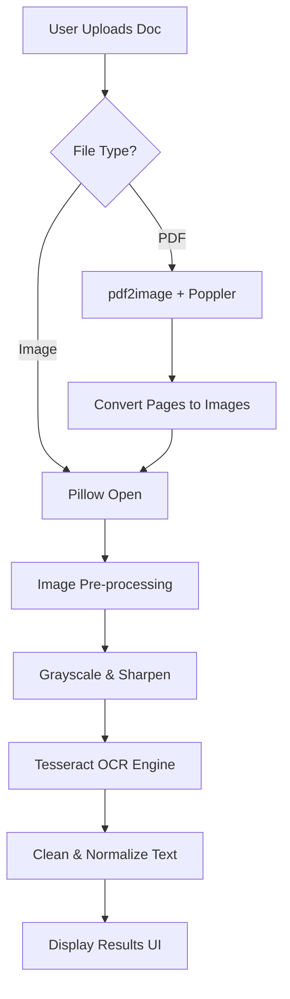

# Document OCR

A modern, fast, and 100% offline document OCR application. Built with FastAPI and Tesseract OCR, it allows you to extract text from images and PDFs with a premium, glassmorphism-inspired UI.

---

## Features

- **Offline Processing**: No data ever leaves your machine.
- **Multi-Format Support**: Works with JPG, PNG, WEBP, TIFF, and multi-page PDFs.
- **Image Pre-processing**: Automatic grayscale, contrast enhancement, and sharpening for higher accuracy.
- **Dynamic Loading UI**: Professional status updates during long processing tasks.
- **Action Oriented**: One-click copy and text file download.

---

## System Requirements

Since this project runs offline, you must have the following engines installed on your Windows machine:

### 1. Tesseract OCR
- Download the installer from UB-Mannheim Tesseract.
- **Default Path**: C:\Program Files\Tesseract-OCR\tesseract.exe
- *Note: During installation, check "Additional language data" if you need Hindi/other support.*

### 2. Poppler
- Download the binary ZIP from Poppler for Windows.
- Extract it to a folder (e.g., X:\DocumentOCR\poppler).
- Update the path in backend/image_utils.py.

---

## Installation

1. **Clone the repository**
   ```bash
   git clone https://github.com/DhairyJoshi/DocumentOCR.git
   cd DocumentOCR
   ```

2. **Setup Virtual Environment**
   ```bash
   cd backend
   python -m venv venv
   .\venv\Scripts\activate
   ```

3. **Install Python Dependencies**
   ```bash
   pip install -r requirements.txt
   ```

---

## Running the App

Start the FastAPI server:
```bash
uvicorn main:app --reload --port 8000
```
Open http://localhost:8000 in your browser.

---

## Workflow Diagram



---

## Project Structure

```text
DocumentOCR/
├── backend/
│   ├── main.py           # FastAPI routes & server config
│   ├── ocr_service.py    # Tesseract wrapper & cleaning logic
│   ├── image_utils.py    # Poppler & Image enhancement
│   └── requirements.txt  # Python libraries
├── frontend/
│   ├── index.html        # Upload & loading UI
│   ├── result.html       # Extracted text & actions
│   ├── style.css         # Dark glassmorphism styles
│   └── app.js            # Frontend logic & API calls
└── .gitignore
```

---

## License
Distributed under the MIT License. See LICENSE for more information.

---

## Contributing
Contributions are what make the open-source community such an amazing place to learn, inspire, and create. Any contributions you make are greatly appreciated.
